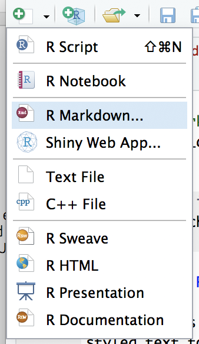
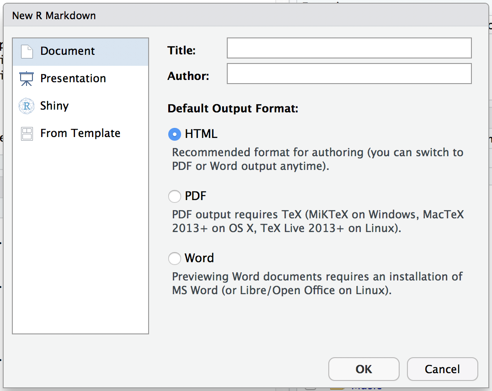
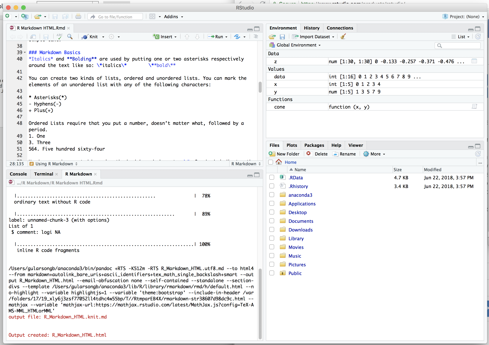
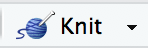
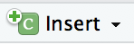
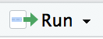

---
title: "R Markdown Tutorial"
output:
  html_document: default
---

```{r setup, include=FALSE}
knitr::opts_chunk$set(echo = TRUE)
```


# How to use R Markdown

R markdown is a useful tool, providing support for both the inclusion of data and styled text to show your results in a meaningful way. It can be converted into a plethora of different formats for you to view and spread much easier.

## Installing R Markdown

R Markdown comes with R Studio which can be downloaded at the [R Studio website]( https://www.rstudio.com/products/rstudio/). You can follow their instructions on how to install R Studio, however most computers in LNG should already have it installed.

* * *
## Creating R Markdown Document

You can create an R Markdown file by opening R Studio and selecting the dropdown menu with a paper and a plus and selecting R Markdown from the menu. 



This will open up a new window prompting you for all the necessary information to create the document. The top left asks you for the title and author of the document which will be displayed when it is created. The left side is the type of document you would like to make, a normal document, presentation, shiny app, or one of the above from a template. The right side asks for the type of output you want for the document. These will change based on the type of document you picked from the left sidebar, and the output format can be selected from within the document itself.



* * *
## Using R Markdown

The user interface for R Markdown is no different than that of R Studio. The document is displayed in the top left, the console/terminal in the bottom left, variable names/ ran lines of code in the top right, and your files in the bottom right. 


At the top of the document’s window, there is a banner with buttons on them. The ones you need to know are:

 * Knit – allows you to convert the markdown file into different other formats, dependent on the type of R Markdown file you selected.
 
 *	Insert – allows you to insert a code block wherever the cursor is placed. The language of the block can be selected when you make it in the dropdown menu.
 
 
 *	Run – allows you to run lines, chunks, or even just the setup of your document. Alternatively the dropdown also shows the shortcuts so you can use those instead of going to the button every time.
 


* * *
## Using Markdown
The plaintext that you see on the screen is written in Markdown, the reason the application is called R Markdown. Markdown is a Markup language, similar to HTML, which allows you to insert links, pictures, tables, lists, headers, and more into simple text.

### Markdown Basics
*Italics* and **Bolding** are used by putting one or two asterisks respectively around the text like so: \*italics\*        \*\*bold\*\*

You can create two kinds of lists, ordered and unordered lists. You can mark the elements of an unordered list with any of the following characters:

* Asterisks(*)
- Hyphens(-)
+ Plus(+)

Ordered Lists require that you put a number, doesn’t matter what, followed by a period.
1. One
3. Three
564. Five hundred sixty-four

Headers can be created by using the hash/pound character \#. One hash indicates the largest heading and adding more makes them smaller up until heading five.

# Heading 1
## Heading 2
### Heading 3
#### Heading 4
##### Heading 5

### Other useful things

You can add links to documents by adding square brackets around the text you want to use as the link, and then copy and paste the url in parenthesis right after the square brackets ex:
[To markdown tutorial](https://github.com/jupyter/notebook/blob/3b84442f214e28296f0affd79699ca26f44790c1/docs/source/examples/Notebook/Working%20With%20Markdown%20Cells.ipynb) is written:
\[To markdown tutorial\]
\(https://github.com/jupyter/notebook/blob/3b84442f214e28296f0affd79699ca26f44790c1/docs/source/examples/Notebook/Working%20With%20Markdown%20Cells.ipynb\)

Tables can be created using a combinataion of these characters: \| and \-.
You simply make a box with these characters around the data to create the table:

|Header 1 | Header 2|
|---------|---------|
|data 1.1 |data 2.1 |
|data 1.2 |data 2.2 |

Pictures are easy to add, just make sure that this file is at the same directory or the picture is in a subdirectory of the notebook's directory. You can add a photo by typing in triangle brackets "" ex:


For those who use a lot of more complex equations, Markdown allows you to write those using [MathJax](https://www.mathjax.org/) to easily get equations on the page. Ex:
$$x = {-b \pm \sqrt{b^2-4ac} \over 2a}$$
\$\$x = {-b \pm \sqrt{b^2-4ac} \over 2a}\$\$


* * *
## Using Code

Code in R Markdown is separated from the text by using grave \` character. In order to insert code into the document, you put three grave characters in a row \`\`\` followed by curly brackets or braces {} inside the braces you put the name of the language, which in most cases will be R. You can put other options in the brackets such as:
  
  *	Include – decides whether the code chunk and its output are shown in the final document. The code is still run and variables from the chunk can be used elsewhere, but it is not shown
  *	Echo – prevents code chunk, but not results from appearing in the final document.
  *	Message – prevents messages from the code from appearing in the file.
  *	Warning – prevents warnings from the code from appearing in the file.

Ex:
```{r comment = NA,echo = FALSE}

cat("```{r echo = FALSE}",
"
x = 0:4",
"
y = seq(1,9,2)",
"
plot(x,y)",
"
```")

```
Displays:

```{r echo = FALSE,warning = FALSE}

x = seq(0,4)
y = seq(0,8,2)
plot(x,y)

```

Code does not have to be written in large chunks. If you only want to have a single line of code, you can use single grave keys as delimiters. Inside the first thing is the language and then the one line of code. Ex:

```{r comment = NA, echo = FALSE}
cat("`r x `")
```

Displays:

`r x`


For further information you can visit the [R Studio’s Documentation]( https://rmarkdown.rstudio.com/lesson-1.html) on R Markdown.
